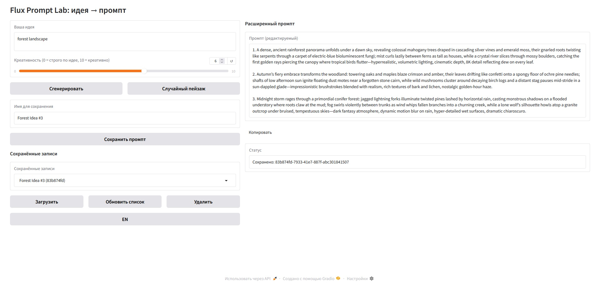

<h1 align="center">Flux Prompt Lab</h1>

Программа на Python 3.10, созданная для удобной работы с промптами в локальной версии text-to-image нейросети Stable Diffusion. 

## Основной функционал и особенности:
*   Переработка короткой идеи в расширенный промпт путем направления запроса на API LLM (OpenRouter);
*   Генерация случайного пейзажа одной кнопкой;
*   Сохранение, загрузка и удаление промптов через SQLite;
*   Графический интерфейс в браузере на Gradio;
*   Выбор языка интерфейса (русский/английский);
*   Запуск программы происходит через .bat-файл.

